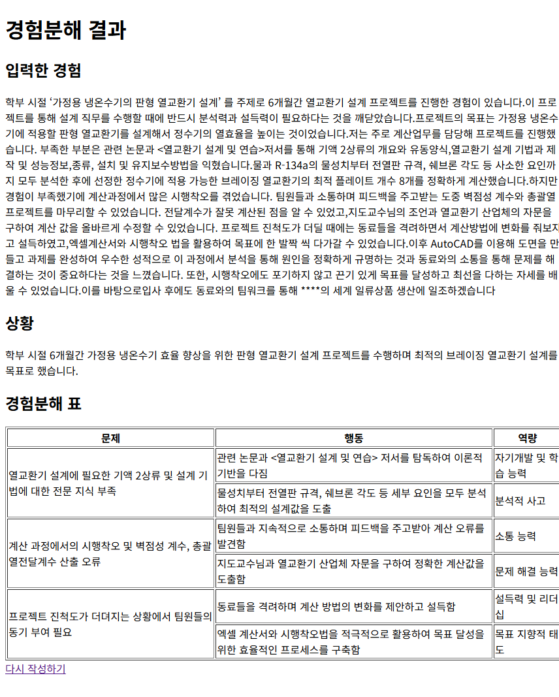

 # Spring AI 경험분해 표 생성 페이지

사용자가 자신의 경험을 입력하면 Spring AI가 경험을 `상황 → 문제 → 행동 → 역량` 구조로 분해하고, Thymeleaf 화면에서 표 형태로 보여준다.

---

## 1. 개요

취업 준비 과정에서 사용하는 **경험분해 표**를 웹 화면으로 간단하게 만들어봤다.

사용자가 경험 서술문을 입력하면 AI가 다음 구조로 분석한다.

```text
상황
 └─ 문제 목록
     └─ 행동 목록
         └─ 역량
```

분석 결과는 화면에서 다음과 같이 출력된다.

```text
상황

문제 | 행동 | 역량
```
---

# 2. 사용 모델

| 항목 | 내용 |
|---|---|
| AI 연동 방식 | Spring AI `ChatClient` |
| 사용 모델 | `gemini-3.1-flash-lite` |
| 응답 처리 방식 | `.entity(ExperienceBreakdownResponse.class)` |
| 응답 형태 | Java record 기반 JSON 객체 |
| DB 사용 여부 | 사용하지 않음 |

---

# 3. 기술 스택

| 구분 | 기술 |
|---|---|
| Language | Java |
| Framework | Spring Boot |
| AI | Spring AI |
| Template Engine | Thymeleaf |
| Build Tool | Gradle |
| DTO | Java record |
| View | HTML / Thymeleaf |

---

# 4. 주요 기능

| 기능 | 설명 |
|---|---|
| 경험 입력 | 사용자가 자신의 경험을 `textarea`에 자유롭게 입력 |
| AI 경험분해 | 입력한 경험을 AI가 상황, 문제, 행동, 역량으로 구조화 |
| 표 출력 | Thymeleaf에서 중첩 `th:each`를 사용해 문제별 행동 목록 출력 |
| `rowspan` 적용 | 같은 문제에 여러 행동이 있을 경우 문제 칸을 묶어서 표시 |
| DB 미사용 | AI 응답을 화면에 바로 출력하는 단순 복습용 구조 |

---

# 5. API / 화면 요청 목록

| Method | URL | Controller Method | View | 설명 |
|---|---|---|---|---|
| GET | `/experience` | `experienceForm()` | `experience/experience-form` | 경험 입력 화면을 보여줌 |
| POST | `/experience` | `analyzeExperience()` | `experience/experience-result` | 입력한 경험을 AI로 분석하고 결과 화면을 보여줌 |

이 프로젝트는 REST API 응답이 아니라 Thymeleaf 화면 반환 방식으로 구현했다.

---

# 6. 프로젝트 구조

```text
src/main/java/com/study/day02promptoutput/day2experience
 ├─ controller
 │   └─ ExperienceController.java
 │
 ├─ dto
 │   ├─ ActionItem.java
 │   ├─ ExperienceBreakdownResponse.java
 │   ├─ ProblemGroup.java
 │   └─ ResumeResponse.java
 │
 └─ service
     └─ ExperienceService.java

src/main/resources/templates/experience
 ├─ experience-form.html
 └─ experience-result.html
```

---

# 7. DTO 구조

경험분해 결과의 최상위 DTO.

```java
ExperienceBreakdownResponse
public record ExperienceBreakdownResponse(
        String situation,
        List<ProblemGroup> problems
) {
}

```

| 필드명 | 설명 |
|---|---|
| `situation` | 경험 전체의 상황, 목표, 배경 |
| `problems` | 경험 중 발생한 문제 목록 |

```java
public record ProblemGroup(
        String problem,
        List<ActionItem> actions
) {
}

```
하나의 문제와 그 문제를 해결하기 위한 행동 목록을 담는다.

| 필드명 | 설명 |
|---|---|
| `problem` | 경험 중 겪은 문제 또는 어려움 |
| `actions` | 해당 문제를 해결하기 위해 수행한 행동 목록 |

```java
ActionItem
public record ActionItem(
        String actionTaken,
        String competency
) {
}

```

실제 행동과 그 행동에서 드러난 역량을 담는다.

| 필드명 | 설명 |
|---|---|
| `actionTaken` | 문제 해결을 위해 실제로 한 행동 |
| `competency` | 행동에서 드러난 역량 |

```java
ResumeResponse
public record ResumeResponse(
        String title,
        String content,
        String coreCompetency
) {
}
```

이력서 또는 자기소개서 문장 생성을 확장할 때 사용할 수 있는 DTO.
현재 최종 화면에서는 경험분해 표 출력에 집중하기 위해 사용하지 않음.

---

# 8. Service 핵심 코드

```java
public ExperienceBreakdownResponse breakdownExperience(String experience) {
    return chatClient.prompt()
            .user(u -> u.text(
                    \"\"\"
                    아래 경험을 취업 준비용 경험분해 표로 정리해줘.

                    응답은 다음 Java record 구조에 맞게 작성해줘.

                    최상위 객체:
                    - situation: 경험의 전체 상황, 목표, 배경
                    - problems: 문제 목록

                    problems의 각 항목:
                    - problem: 겪었던 문제 또는 어려움
                    - actions: 행동 목록

                    actions의 각 항목:
                    - actionTaken: 문제 해결을 위해 실제로 한 행동
                    - competency: 그 행동에서 드러난 역량

                    조건:
                    - situation은 전체 경험을 대표하는 하나의 문장으로 작성
                    - problems는 2개에서 4개 정도로 작성
                    - 각 problem마다 actions를 1개에서 4개 작성
                    - 사용자가 입력한 경험을 바탕으로만 작성
                    - 과장하지 말고 구체적으로 작성

                    사용자 경험:
                    {experience}
                    \"\"\"
            ).param(\"experience\", experience))
            .call()
            .entity(ExperienceBreakdownResponse.class);
}
```

---

# 9. Thymeleaf 출력 핵심 코드

```html
<tbody>
<th:block th:each=\"problem : ${breakdown.problems}\">
    <tr th:each=\"action, actionStat : ${problem.actions}\">
        <td th:if=\"${actionStat.index == 0}\"
            th:rowspan=\"${problem.actions.size()}\"
            th:text=\"${problem.problem}\">
        </td>

        <td th:text=\"${action.actionTaken}\"></td>
        <td th:text=\"${action.competency}\"></td>
    </tr>
</th:block>
</tbody>
```

---

# 10. 실행 방법

### 1) 브라우저 접속

서버 실행 후 브라우저에서 아래 주소로 접속.
http://localhost:8080/experience

### 2) 경험 입력

textarea에 경험을 입력한 뒤 경험분해하기 버튼을 클릭한다.

### 3) 결과 확인

AI가 분석한 결과가 다음 형태로 출력된다.

입력한 경험
상황
경험분해 표
- 문제
- 행동
- 역량

---

# 11. 화면 캡처

경험분해 결과 화면



---

# 12. 배운 것
### 1) Java record DTO 사용

기존 class 방식이 아니라 record를 사용해 간단한 응답 객체를 만들었다.

```java
public record ActionItem(
        String actionTaken,
        String competency
) {
}
```

record는 생성자, getter 역할의 메서드, equals, hashCode, toString을 자동으로 만들어주기 때문에 단순 DTO에 적합.

### 2) record 안에 다른 record와 List 넣기

처음에는 한 줄짜리 DTO만 사용했지만, PDF의 경험분해 표처럼 계층형 구조를 표현하려면 DTO 안에 List가 필요하다는 것을 확인.

```java
public record ExperienceBreakdownResponse(
        String situation,
        List<ProblemGroup> problems
) {
}
```

이 구조 덕분에 다음과 같은 중첩 데이터를 표현이 가능했다.

상황 1개
문제 여러 개
문제별 행동 여러 개
행동별 역량 1개

### 3) Spring AI의 .entity() 사용

AI 응답을 단순 문자열이 아니라 Java 객체로 변환.

```code
.entity(ExperienceBreakdownResponse.class)
```

이를 통해 JSON 응답을 직접 파싱하지 않고도 DTO로 받을 수 있었다.

### 4) 프롬프트 템플릿 사용 시 주의점

Spring AI의 .param()을 사용할 때 프롬프트 안의 {experience}는 템플릿 변수로 처리된다.

따라서 프롬프트에 JSON 예시를 그대로 넣으면 {}가 템플릿 변수로 오해되어 다음 오류가 발생할 수 있다.

```code
The template string is not valid.
```
이번에는 JSON 예시 대신 record 필드 구조를 설명하는 방식으로 해결함.

### 5) Controller, Service, DTO 역할 분리

| 계층 | 역할 |
|---|---|
| Controller | 요청을 받고 `Model`에 결과를 담아 View 반환 |
| Service | Spring AI 호출 및 응답 객체 변환 |
| DTO | AI 응답 데이터를 구조화 |
| Thymeleaf | 분석 결과를 HTML 화면에 출력 |

---

# 14. 트러블슈팅
### 1) Thymeleaf 템플릿을 찾지 못하는 오류

```code
Error resolving template [experience-form]
```

원인:

HTML 파일이 templates 폴더 아래에 없었음
하위 폴더 경로와 controller의 return 경로가 맞지 않았음

해결:

```
return \"experience/experience-form\";
```

파일 위치:
```
src/main/resources/templates/experience/experience-form.html
```

### 2) Spring AI 템플릿 문자열 오류

```
The template string is not valid.
```

원인:

프롬프트 안에 JSON 예시의 {}를 그대로 작성함
Spring AI가 {}를 템플릿 변수로 해석함

해결:

JSON 예시를 제거
Java record 필드 구조를 문장으로 설명
{experience}처럼 실제 .param()으로 전달할 변수만 중괄호 사용


### 3) 표 컬럼이 한 칸씩 밀리는 문제

원인:

<thead>에는 상황 / 문제 / 행동 / 역량 4개 컬럼이 있었지만
<tbody>에는 실제로 문제 / 행동 / 역량 3개 컬럼만 출력함

해결:

상황은 표 위에 따로 출력
표는 문제 / 행동 / 역량 3개 컬럼으로 구성

---

# 15. 향후 개선 아이디어

| 개선 항목 | 설명 |
|---|---|
| 이력서 문장 생성 | `ResumeResponse`를 활용해 경험분해 결과 기반 이력서 문장 생성 |
| CSS 적용 | PDF 표처럼 색상과 여백을 적용해 가독성 개선 |
| REST API 추가 | JSON 응답을 확인할 수 있는 `/api/experience` 엔드포인트 추가 |
| 입력 검증 | 빈 입력값 또는 너무 짧은 경험 입력 방지 |
| 로딩 화면 | AI 응답 대기 중 로딩 메시지 표시 |
| 예시 입력 버튼 | 테스트용 경험 예시 자동 입력 기능 추가 |

---

# 16. 정리

이번 실습에서는 Spring AI를 이용해 사용자의 경험을 구조화된 객체로 받고, Thymeleaf 화면에서 표 형태로 출력했다.

```text
사용자 입력
→ Controller
→ Service
→ Spring AI
→ record DTO 객체 응답
→ Model 전달
→ Thymeleaf 표 출력
```

단순한 문자열 응답을 넘어서, AI 응답을 Java 객체로 받아 화면에 출력하는 흐름을 복습할 수 있었다.
