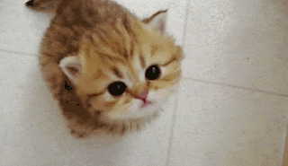

# gifAnalze

GIF 파일을 업로드하면 Gemini가 애니메이션의 내용을 설명해주는 멀티모달 실습 모듈.

Gemini API가 `image/gif`를 직접 지원하지 않아서 **GIF를 프레임 단위 PNG로 변환한 뒤 "여러 장의
이미지"로 모델에 전달**하는 전처리 단계(`GifFrameExtractor`) 추가.

---

## 1. 왜 GIF를 바로 못 보내는가

Gemini 멀티모달 입력이 공식으로 받는 이미지 MIME 타입은 `image/png`, `image/jpeg`, `image/webp`.
`image/gif`는 목록에 없음.
그래서 GIF 파일을 모델에 넘기기 전에 **프레임 단위 PNG 이미지 리스트**로 바꾸는 전처리를
거친다.

---

## 2. 핵심 코드: `GifFrameExtractor`

### 2.1 처리 흐름 요약

```java
List<byte[]> frames = GifFrameExtractor.extractFramesAsPng(gifBytes, MAX_FRAMES);
```

```
GIF 바이트[]
  → ImageIO GIF 리더로 프레임 개수/원본 프레임 읽기
  → 프레임별 메타데이터(좌표, disposalMethod) 파싱
  → 논리 캔버스에 순서대로 합성(compositing)
  → 합성된 완성 프레임 중 N장을 균등 샘플링
  → 각 프레임을 PNG 바이트[]로 인코딩
```


### 2.2 왜 "합성(compositing)"이 필요한가

최적화된 GIF는 프레임마다 **화면 전체를 다시 그리지 않고, 이전 프레임과 달라진
영역만** 담고 있다. 그래서 `ImageReader.read(index)`로 얻은 프레임 이미지를 그대로 PNG로
저장하면 그림 일부가 비어 보이거나 깨진 것처럼 보인다.

이를 해결하려면 GIF 메타데이터 두 가지를 읽어야 한다.

```java
extractFramesAsPng(gifBytes, maxFrames)
  └─ compositeAllFrames(reader, totalFrames)   // 프레임 개수만큼 반복(loop)
        └─ for (int i = 0; i < totalFrames; i++) {
               BufferedImage frame = reader.read(i);
               FrameInfo info = readFrameInfo(reader.getImageMetadata(i));   // ← 매 프레임마다 여기서 호출됨
               ...
           }
```

| 메타데이터 노드 | 읽는 값 | 용도 |
|---|---|---|
| `ImageDescriptor` | `imageLeftPosition`, `imageTopPosition` | 이 프레임을 캔버스의 어느 좌표에 그릴지 |
| `GraphicControlExtension` | `disposalMethod` | 다음 프레임을 그리기 전, 캔버스를 어떻게 처리할지 (`none`, `doNotDispose`, `restoreToBackgroundColor`, `restoreToPrevious`) |

```java
private static FrameInfo readFrameInfo(IIOMetadata metadata) {
    int left = 0;
    int top = 0;
    String disposal = "none";

    IIOMetadataNode root = (IIOMetadataNode) metadata.getAsTree("javax_imageio_gif_image_1.0");

    IIOMetadataNode imageDescriptor = firstChild(root, "ImageDescriptor");
    if (imageDescriptor != null) {
        left = parseIntSafe(imageDescriptor.getAttribute("imageLeftPosition"));
        top = parseIntSafe(imageDescriptor.getAttribute("imageTopPosition"));
    }

    IIOMetadataNode graphicControl = firstChild(root, "GraphicControlExtension");
    if (graphicControl != null) {
        String value = graphicControl.getAttribute("disposalMethod");
        if (value != null && !value.isBlank()) {
            disposal = value;
        }
    }

    return new FrameInfo(left, top, disposal);
}
```

### 2.3 캔버스에 순서대로 합성하기

논리 화면 크기(`reader.getWidth(0)` / `getHeight(0)`)의 투명 캔버스를 하나 만들어두고,
프레임을 순서대로 그린 뒤 **매 프레임마다 캔버스를 복사해서 "그 시점의 완성된 그림"으로
저장**한다. 이전 프레임의 `disposalMethod`에 따라 다음 프레임을 그리기 전에 캔버스를
지우거나 이전 상태로 되돌리는 처리가 들어간다.

```java
private static List<BufferedImage> compositeAllFrames(ImageReader reader, int totalFrames) throws IOException {
    int canvasWidth = reader.getWidth(0);
    int canvasHeight = reader.getHeight(0);
    BufferedImage canvas = new BufferedImage(canvasWidth, canvasHeight, BufferedImage.TYPE_INT_ARGB);
    Graphics2D g2d = canvas.createGraphics();

    List<BufferedImage> result = new ArrayList<>();
    BufferedImage previousSnapshot = null;
    String previousDisposal = "none";

    for (int i = 0; i < totalFrames; i++) {
        BufferedImage frame = reader.read(i);
        FrameInfo info = readFrameInfo(reader.getImageMetadata(i));

        // 이전 프레임의 disposalMethod에 따라 캔버스를 먼저 정리
        if ("restoreToBackgroundColor".equals(previousDisposal)) {
            g2d.clearRect(0, 0, canvasWidth, canvasHeight);
        } else if ("restoreToPrevious".equals(previousDisposal) && previousSnapshot != null) {
            g2d.drawImage(previousSnapshot, 0, 0, null);
        }

        // restoreToPrevious를 대비해 "지금" 상태를 미리 스냅샷
        if ("restoreToPrevious".equals(info.disposalMethod())) {
            previousSnapshot = deepCopy(canvas);
        }

        // 이 프레임을 지정된 좌표에 그려 넣는다
        g2d.drawImage(frame, info.left(), info.top(), null);
        result.add(deepCopy(canvas)); // 완성된 한 장으로 저장

        previousDisposal = info.disposalMethod();
    }

    g2d.dispose();
    return result;
}
```

`deepCopy()`가 필요한 이유: `canvas` 객체 하나를 계속 그려 나가는 방식이라, 참조를 그대로
리스트에 넣으면 나중에 그려진 내용이 이전 프레임들에도 다 반영되어 버린다. 그래서 매번
새 `BufferedImage`로 복사해서 저장한다.

### 2.4 프레임 샘플링 — 토큰 비용 제어

GIF는 짧아도 수십~수백 프레임인 경우가 많다. 프레임 전부를 이미지로 보내면 토큰 비용이
과도하게 커지므로, 합성이 끝난 프레임 중 **최대 `maxFrames`장을 시간축 기준으로 균등하게
추출**한다.

```java
private static List<Integer> sampleIndexes(int total, int maxFrames) {
    List<Integer> indexes = new ArrayList<>();
    if (total <= maxFrames) {
        for (int i = 0; i < total; i++) {
            indexes.add(i);
        }
        return indexes;
    }
    double step = (double) total / maxFrames;
    for (int i = 0; i < maxFrames; i++) {
        indexes.add((int) Math.floor(i * step));
    }
    return indexes;
}
```

`GifAnalysisService`에서 `MAX_FRAMES = 6`으로 기본값을 잡아뒀다. 동작이 빠르고 복잡한 GIF는
이 값을 8~10으로 올리면 더 촘촘하게 잡아낼 수 있지만, 그만큼 이미지 토큰 비용이 늘어난다.

### 2.5 PNG로 인코딩

합성이 끝난 `BufferedImage`를 Gemini가 지원하는 `image/png` 바이트로 변환하는 마지막
단계는 `ImageIO.write`로 간단히 처리한다.

```java
private static byte[] toPngBytes(BufferedImage image) throws IOException {
    ByteArrayOutputStream out = new ByteArrayOutputStream();
    ImageIO.write(image, "png", out);
    return out.toByteArray();
}
```

---

## 3. 변환된 프레임을 모델에 전달하는 방식

`GifAnalysisService`는 추출된 PNG 프레임들을 `Media` 리스트로 감싸고,
"시간 순서대로 나열된 애니메이션 프레임"이라는 점을 프롬프트에 명시해 `UserMessage`에 실어
보낸다.

```java
List<Media> mediaList = frames.stream()
        .map(png -> Media.builder()
                .mimeType(MimeTypeUtils.IMAGE_PNG)
                .data(new ByteArrayResource(png))
                .build())
        .toList();

UserMessage userMessage = UserMessage.builder()
        .text(prompt)
        .media(mediaList)
        .build();

return chatClient.prompt(new Prompt(userMessage))
        .call()
        .content();
```

> Spring AI 최신 버전에서는 `UserMessage(String, List<Media>)` 생성자가 사라지고
> `UserMessage.builder().text(...).media(...).build()` 형태만 지원한다.

---

## 4. 사용법

**엔드포인트:** `POST /api/gif-analysis`

**요청:** `multipart/form-data`, key `file` (GIF 파일)



**응답 예시:**

```json
{
    "description":"제공해주신 프레임들을 시간 순서대로 살펴보면, 아기 고양이가 카메라(혹은 사람)를 올려다보며 **'야옹'하고 울음소리를 내는 동작**을 담고 있습니다. 구체적인 변화는 다음과 같습니다.
    
    1.  **초기 상태:** 첫 번째 프레임에서 아기 고양이는 입을 굳게 다문 채 동그랗고 큰 눈으로 정면(카메라)을 빤히 응시하고 있습니다.
    2.  **동작의 시작:** 이어지는 프레임들에서 고양이가 입을 벌리기 시작합니다. 입이 점점 아래로 크게 벌어지며 울기 직전의 모습을 보여줍니다.
    3.  **최대 동작:** 중간 프레임들에서 입을 최대한 크게 벌린 상태가 되며, ...
}
```

**검증 조건:** `Content-Type`이 정확히 `image/gif`가 아니면 `400 Bad Request`.

---

## 5. 파일 구성

| 파일 | 역할 |
|---|---|
| `GifFrameExtractor.java` | GIF 바이트 → 합성된 PNG 프레임 리스트 (핵심 로직) |
| `GifAnalysisService.java` | 검증 → 프레임 추출 → Gemini 호출 → 텍스트 응답 |
| `GifAnalysisController.java` | `POST /api/gif-analysis` 엔드포인트 |
| `GifAnalysisResponse.java` | 응답 DTO |

